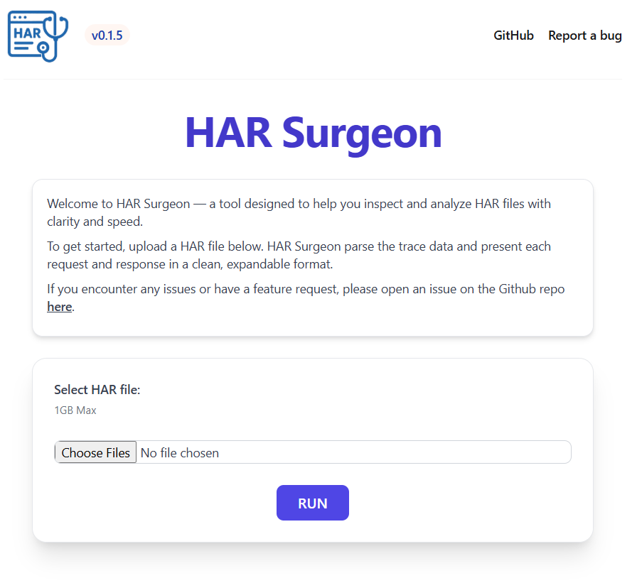
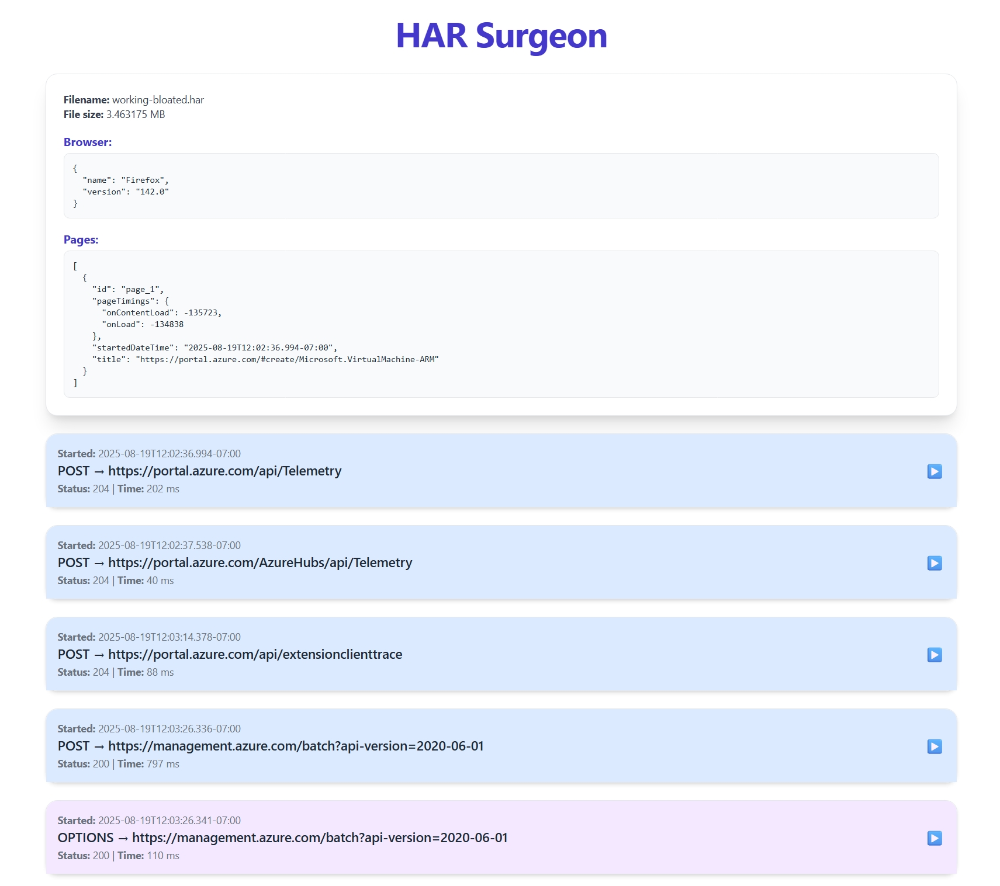

# HAR Surgeon


## Features

- 🔥**Blazingly Fast and responsive**🔥 - Front end uses only HTML, Alpine.JS and Tailwind-CSS.
- **Accessibily** - Parses HAR files and extracts the data in a readable web-based interface.
- **Secure** - Data is kept local to the machine, and stored in RAM.
- **Offline Support** - App can be ran with out any internet connection. All logic is ran locally on the machine.
- **Multi-Tasking** - Supports multiple browser windows to allow for checking multiple traces at once.


## Usage

- Upload or paste your HAR Trace into the web page.
- Once you submit the HAR trace via the `upload` button, the trace will be parsed and then displayed.


## Examples

> Home page



<br>

> HAR File Viewer




## Setup

### Docker (Recommended)

Docker run

```bash
docker run -p 4000:4000 --name har-surgeon jimurrito/har-surgeon:latest
```

Docker Compose

```yaml
version: '3.8'

services:
  har-surgeon:
    container_name: har-surgeon
    image: jimurrito/har-surgeon:latest
    ports:
      - "4000:4000"
```

[Link to docker repo](https://hub.docker.com/r/jimurrito/har-surgeon)

### From Source (Windows & Linux)

1. Install Elixir 1.18 and Erland OTP 27:

    - [Elixir 1.18](https://elixir-lang.org/install.html)
    - [Erland OTP 27](https://www.erlang.org/downloads/27)

2. Validate install:
    ```bash
    $> elixir -v

    # Erlang/OTP 27 [erts-15.2.4] [source] [64-bit] [smp:12:12] [ds:12:12:10] [async-threads:1] [jit:ns]
    # Elixir 1.18.3 (compiled with Erlang/OTP 27)
    ```

3. Clone the repository:
    ```bash
    git clone https://github.com/jimurrito/har_surgeon.git
    cd har-surgeon
    ```

4. Install dependencies:
    ``` bash
    mix deps.get
    ```

5. Start the web server:
   ```
   mix phx.server
   ```

6. Open your browser to [http://localhost:4000](http://localhost:4000)


## Notes
HAR traces can and will capture all data input and output from the captured browser session. Some data maybe senstive and contain PII. Please be aware that the traces are displayed `as-is` and will not automatically redact senstive material PII from the trace.

> It will however remove the bearer token from the HTTP headers when the trace is displayed. If the OAUTH bearer token called `Authorization` is passed, the value will always be displayed as `REDACTED`.


## Feature backlog
- ~~Streamline UI design.~~
- ~~Ability to redact known sensitve data like `bearer tokens`.~~
- Time-based garbage collection of the HAR file RAM cache.

## Links

- [Github](https://github.com/jimurrito/Har-Surgeon)
- [Docker Hub](https://hub.docker.com/r/jimurrito/har-surgeon)
